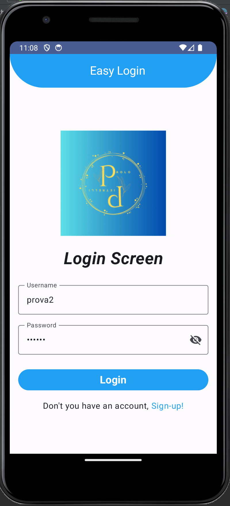
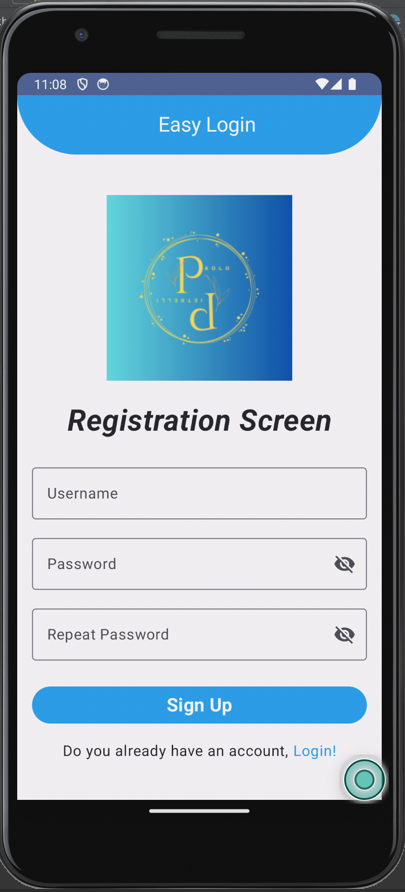

# EasyLogin

**EasyLogin** is a simple Android project developed in Kotlin that demonstrates a login and registration application using Jetpack Compose and the MVVM architecture.

## Features

- **Login and Registration:**
    - Login screen with fields for username and password.
    - Registration screen with input validations (required fields, length limits, and password confirmation).
- **Validation and Feedback:**
    - Displays error and success messages using Snackbar notifications.
- **MVVM Architecture:**
    - Separates business logic (ViewModel and Repository) from the UI.
- **Navigation:**
    - Navigates between login and registration screens using Navigation Compose.
- **Responsive Design:**
    - Supports screen rotation and scrollable content to ensure all UI elements are visible.

## Technologies Used

- Kotlin
- Jetpack Compose
- Material3
- Navigation Compose
- Coroutines
- MVVM Architecture

## Screenshots and Demo

### Login Screen

### Registration Screen

### Application Demo
You can watch a demo video of the application in action:

